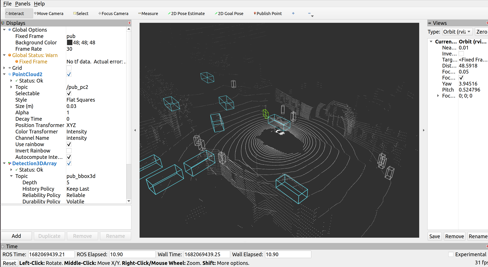

# ROS real-time 3D point cloud detection

## prequisites

- ROS2(humble, foxy)
- vision-msgs
- vision-msgs-rviz-plugins
- tf-transformation
- sensor-msgs
- mmdet3d(temporary) 1.0.0-rc6

## build

### 1. install dependencies

```bash
rosdep install --from-paths src --ignore-src -r -y
```

Note:

If you are using Foxy distro instead of Humble, you need to manually build these dependencies:
- vision-msgs
- vision-msgs-rviz-plugins


### 2. rewrite config

In the patch 0.0.2, we introduced the ros2 params feature in order to avoid verbose build. You can rewrite the config file `config.yaml` in `conf/` directory.

#### params

1. pub_nuscenes_bin
    - time_period

        Time period for releasing the point cloud. In nuscenes source, it is the frequency of publishing point cloud; in real-time lidar scan, it is the scan frequency.

    - nus_lidar_path

        The path to the pointcloud folder. It should end with 'LIDAR_TOP'.
        
2. infer_node
    - score_threshold

        The threshold of score for filtering the detection result.

    - mmdet3d_path

        The absolute path to the mmdet3d package.

    - config_file

        The relative path of config file in mmdet3d path.

    - checkpoint_file
    
        The absolute path to the checkpoint file.(.pth)
        
    - onnx_model(supported in v1.0.x)
        
        The absolute path to the onnxruntime model file.(.onnx)


### 3. build

```bash
colcon build --packages-select pc_det
. install/setup.bash
```

## run

### nuscenes demo source(nuscenes mini)

1. base demo (mmdet3d api)

``` bash
ros2 launch pc_det nuscenes_demo_launch.py
```

2. ort-gpu infer (still bug)

``` bash
ros2 launch pc_det nuscenes_ort_launch.py
```

3. direct pc2 format inference(skip the file
 transform)

``` bash
ros2 launch pc_det nuscenes_pc_launch.py
```

4. run depthcam detection demo

``` bash
ros2 launch pc_det depthcam_demo_launch.py
```


## screenshots


